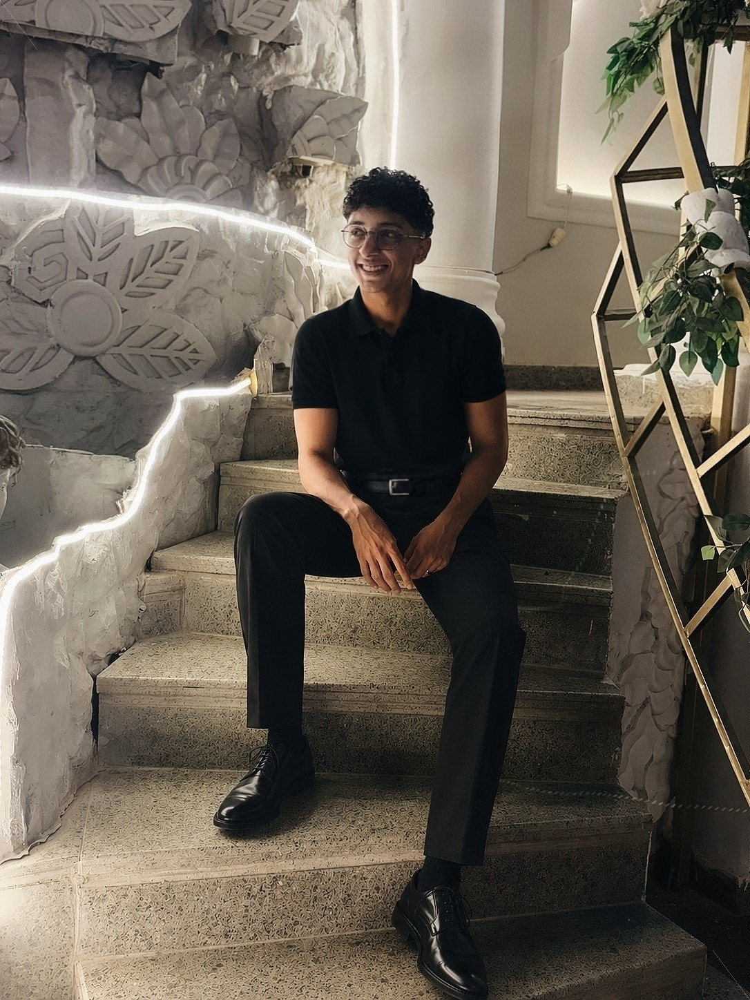

# SJ ADV. — Premium Landing Page

A production-quality, bilingual (English / Arabic) landing page for a graphic design portfolio. Built with vanilla HTML5, CSS3, and JavaScript — no frameworks, no build step.



## ✨ Features

- **Bilingual EN / AR** with proper RTL layout adaptation
- **Dark / Light theme** with system preference detection + localStorage persistence
- **Fully responsive** from 1920px desktop down to 320px small mobile
- **Smooth animations** — hero entrance, scroll reveal (IntersectionObserver), staggered cards, floating elements
- **Premium aesthetic** — electric lime accent on near-black, custom typography (Cairo + Plus Jakarta Sans + Space Grotesk)
- **Accessible** — semantic HTML, keyboard nav, focus states, ARIA labels, reduced-motion support
- **Performant** — lazy-loaded images, optimized assets (~3MB total), no heavy libraries
- **SEO-ready** — meta description, Open Graph, Twitter cards, semantic structure, favicon

## 🚀 How to run

This is a static site. **Just open `index.html` in your browser.**

```bash
# Option 1: Double-click index.html
# Option 2: From terminal
open index.html        # macOS
xdg-open index.html    # Linux
start index.html       # Windows
```

Optional — serve locally for a more accurate environment:

```bash
# Python 3
python3 -m http.server 8080
# Then visit http://localhost:8080
```

## 📁 Project structure

```
landing-page/
├── index.html              # Main HTML markup
├── css/
│   └── style.css           # Complete design system, themes, responsive, RTL
├── js/
│   └── script.js           # i18n, theme, navigation, animations, filters
├── assets/
│   └── images/
│       ├── logo.jpg        # SJ ADV. logo
│       ├── person.jpg      # Designer portrait (hero + about)
│       ├── hero-bg.jpg     # Atmospheric hero backdrop
│       └── work-1 … 6.jpg  # Portfolio thumbnails
└── README.md
```

## 🌐 Language system

The translation system is a plain JavaScript object in `js/script.js`:

```js
const translations = {
  en: { 'nav.home': 'Home', … },
  ar: { 'nav.home': 'الرئيسية', … }
};
```

Any element with a `data-i18n="key"` attribute gets its `textContent` swapped on language change. The `<html lang>` and `<html dir>` attributes are also updated.

**To add a new string:**
1. Add the key to both `en` and `ar` objects in `translations`.
2. Use it in HTML: `<span data-i18n="my.key">Default</span>`.

**To switch default language:** edit `getPreferredLang()` in `js/script.js` (currently defaults to `ar`).

## 🎨 Theme system

Themes are powered by CSS variables on `:root` (dark, default) and `[data-theme="light"]` (light). Toggle persists in `localStorage` under the key `sjadv-theme`. On first visit, the user's `prefers-color-scheme` system preference is respected.

**To customize the palette:** edit the CSS variables at the top of `css/style.css`:

```css
:root {
  --accent: #c8ff00;  /* primary accent */
  --bg:     #0a0a0a;  /* main background */
  --text:   #f5f5f7;  /* main text */
}
```

## 🖼️ How to change images

1. Drop your image into `assets/images/`.
2. Reference it in `index.html`:

```html

```

Always include `alt` text and `loading="lazy"` for images below the fold.

## 🔤 How to change text

Text is driven by the `data-i18n` keys. Edit values in `translations.en` and `translations.ar` inside `js/script.js`. The HTML fallback content is what shows before JS loads.

## 📦 External dependencies

Only **Google Fonts** (loaded via `<link>` in `index.html`):
- Cairo (Arabic)
- Plus Jakarta Sans (English body)
- Space Grotesk (display headings)

No JS libraries. No build tools. No frameworks.

## 🧪 Tested combinations

- ✅ English + Light Mode (desktop / tablet / mobile)
- ✅ English + Dark Mode  (desktop / tablet / mobile)
- ✅ Arabic + Light Mode  (desktop / tablet / mobile, RTL)
- ✅ Arabic + Dark Mode   (desktop / tablet / mobile, RTL)
- ✅ Resolutions: 1920 / 1440 / 1280 / 1024 / 768 / 480 / 375 / 320

## ♿ Accessibility

- Semantic HTML5 landmarks (`<header>`, `<main>`, `<section>`, `<footer>`, `<nav>`)
- Proper heading hierarchy (`h1` → `h2` → `h3`)
- Keyboard-navigable mobile menu (Escape to close, focus-visible outlines)
- ARIA labels on icon-only buttons
- `prefers-reduced-motion` honored — non-essential animations disabled

## 📝 License

Personal portfolio project. All images and brand assets belong to SJ ADV.
